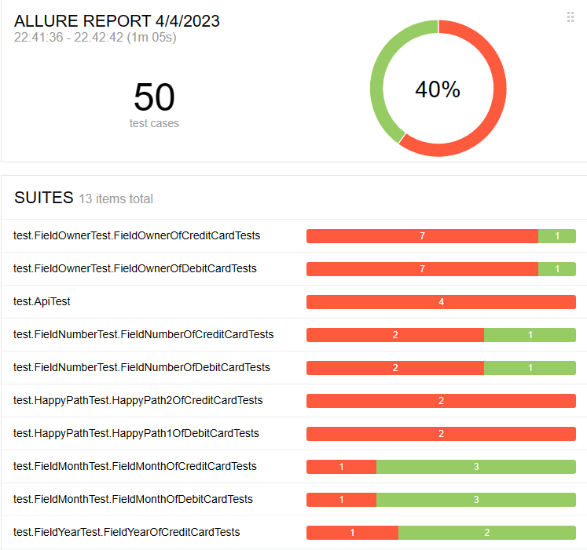
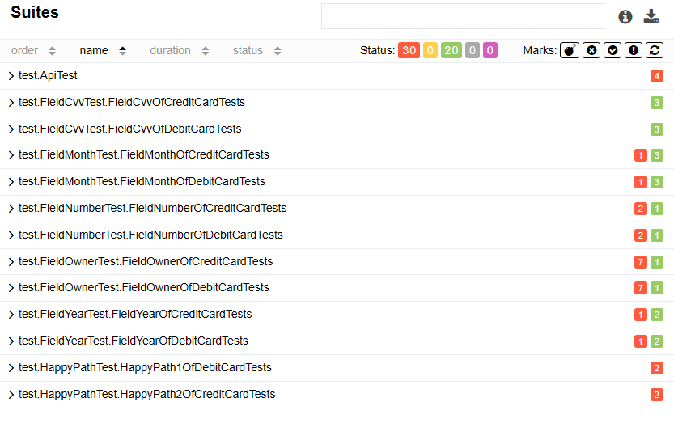

# Отчет по итогам тестрования:

Согласну плану автоматизации, была разработана тестовая среда с возможностью запуска и тестирования SUT под двумя разными СУБД (MySQL и Postgers).

*Allure отчет по итогам прогона автотестов:*

## Итоги тестирования:

- Общее количество реализованных тестовых кейсов - 50. Успешных 20 (40%), неуспешных 30(60%).

**Результаты тестов

## Общие рекомендации:

1. Предусмотреть, чтобы в случае, когда какое-либо поле ввода остается пустым, — под ним появлялось сообщение об ошибке "Поле обязательно для заполнения". В данный момент же показывается сообщение "Неверный формат", что, на мой взгляд, несовсем корректно;
2. Предусмотреть, чтобы кнопка "Продолжить" не была активной (на неё нельзя было нажать), если не заполнено какое-либо из полей или введены ошибочные данные;
3. Сделать так, что кнопки "Купить" и "Купить в кредит" меняли цвет в зависимости от того, какая форма активна (красный — активна, белый — неактивна),
   т.к. сейчас кнопка "Купить в кредит" всегда красная и это несколько сбивает, если переключаться на форму "Оплата по карте";
